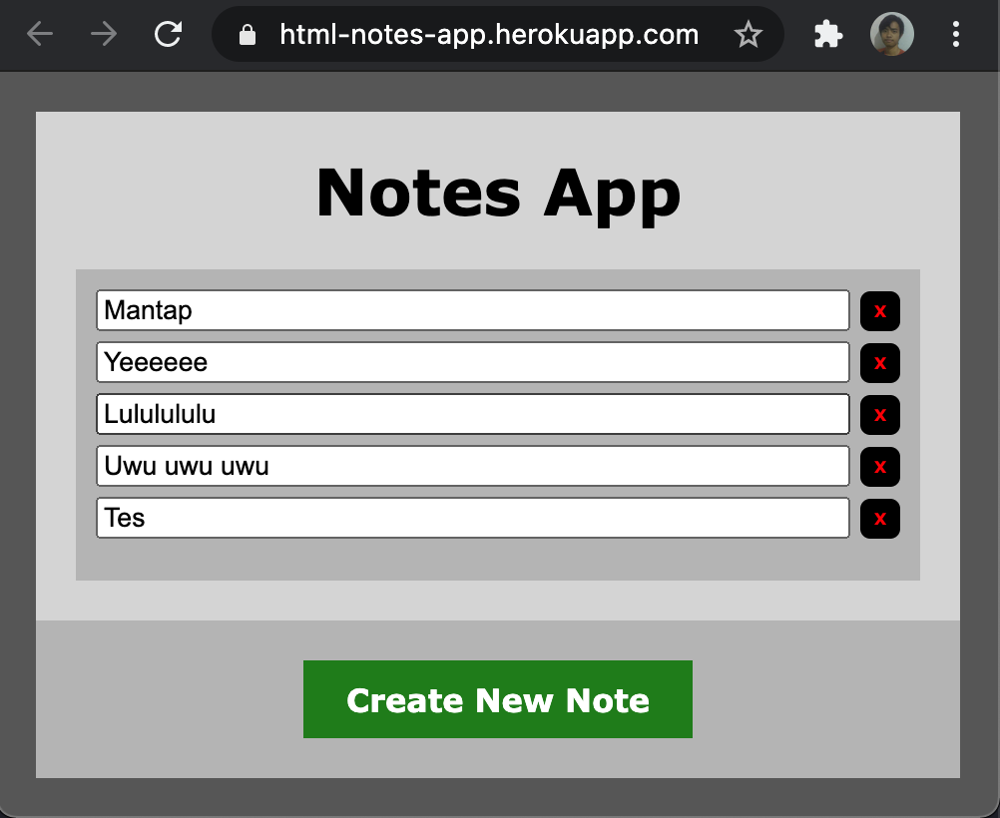
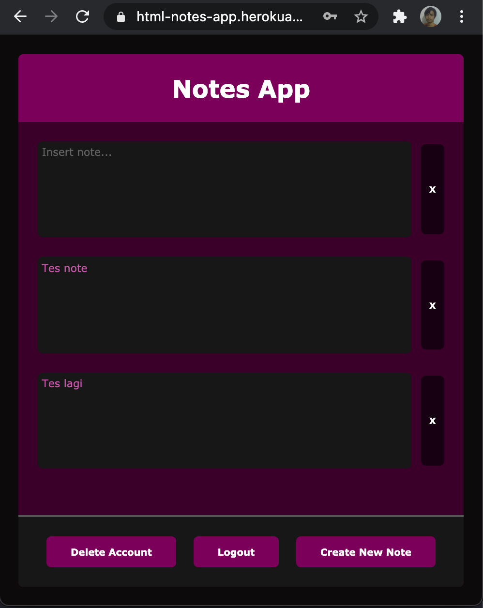
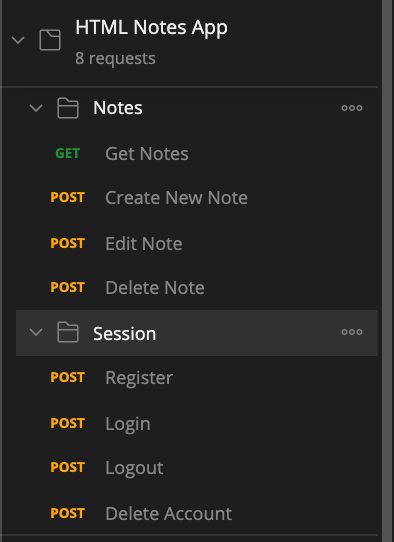
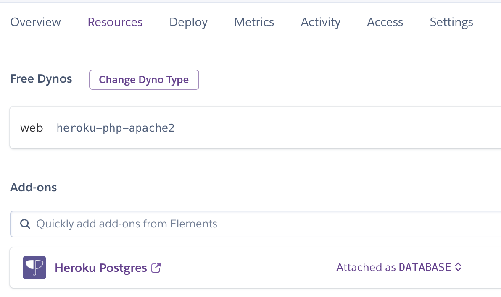
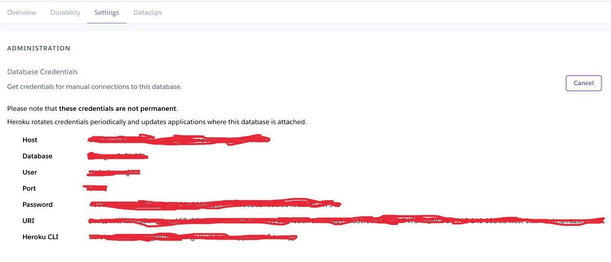
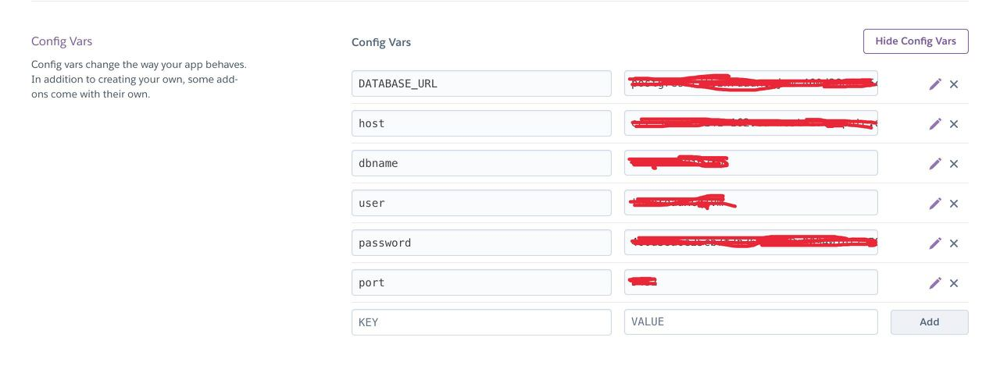

<p align="center">
  
  
  
  
</p>

# HTML Notes App

Web-App Link: https://html-notes-app.herokuapp.com/

<p align="center">
  
  
</p>

Postman Import Link: https://www.getpostman.com/collections/5ef0343a019f2df6c1ab

<p align="center">
  
</p>

## How to deploy to yourself heroku platform?

- Fork this repository
- Login to heroku website
- Create a new heroku app
- Select your new app then go to ```Deploy``` tab, connect to your forked GitHub repo, don't forget check automatic deploy and press deploy branch

<p align="center">
  
</p>

- Select your new app then go to ```Resources``` tab, search and add ```Heroku Postgres``` add-on

<p align="center">
  
</p>

- After add-on added, click at ```Heroku Postgres``` then go to add-on ```Settings``` tab to view credentials

<p align="center">
  
</p>

- Run the ```Heroku CLI``` command at command prompt (cmd) or terminal to access PostgreSQL Database then create ```users``` table like code below (You need to install Heroku CLI to do this)

```
CREATE TABLE users (
  id SERIAL PRIMARY KEY,
  username VARCHAR(20) UNIQUE NOT NULL,
  password VARCHAR(40) NOT NULL,
  created_at TIMESTAMP NOT NULL DEFAULT NOW()
);
```

- Then create ```notes``` table like below

```
CREATE TABLE notes (
  ID SERIAL PRIMARY KEY,
  owner_id  INT NOT NULL,
  text TEXT,
  created_at TIMESTAMP NOT NULL DEFAULT NOW()
);
```

- Run ```\q``` to quit PostgreSQL Database terminal

- Then go back to app details page, go to app's ```Settings``` tab then reveal config, fill config var like this using your own add-on credential

<p align="center">
  
</p>

- Your web-app and API is now live, congrats!!! You can edit the codebase by yourself.

- Click ```Open app``` button on the right top to view the web-app

## How to run locally?

- Make sure ```php``` is installed, check installed version with ```php -v``` command, if the ```php``` is installed, you can run the localhost
- Change directory to project's root folder
- Run the localhost at port 8000 with ```php -S localhost:8000``` command
- Then open the page at ```localhost:8000``` in the browser