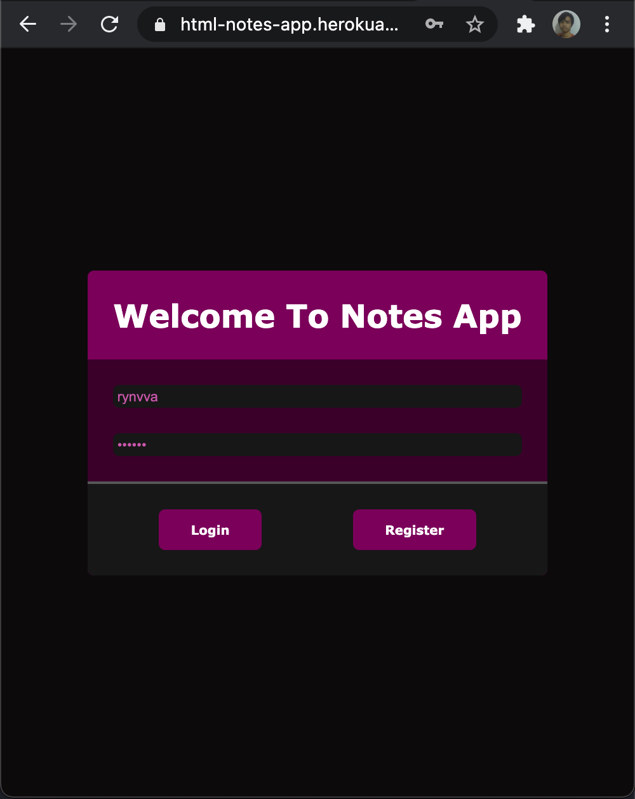

<p align="center">
  
  
  
  
</p>

# HTML Notes App

Web-App Link: https://html-notes-app.herokuapp.com/

Postman Import Link: https://www.getpostman.com/collections/5ef0343a019f2df6c1ab

<p align="center">
  
</p>

## How to run locally?

- Make sure ```php``` is installed, check installed version with ```php -v``` command, if the ```php``` is installed, you can run the localhost
- Change directory to project's root folder
- Run the localhost at port 8000 with ```php -S localhost:8000``` command
- Then open the page at ```localhost:8000``` in the browser